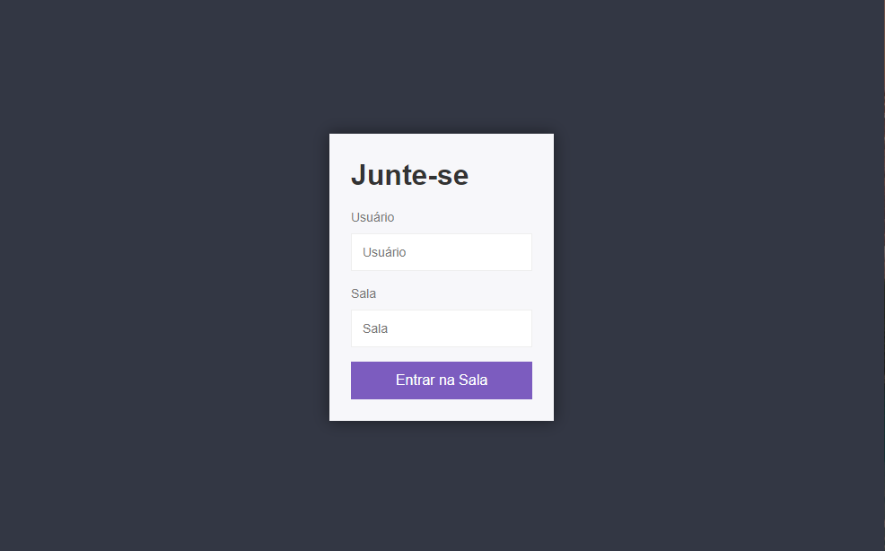
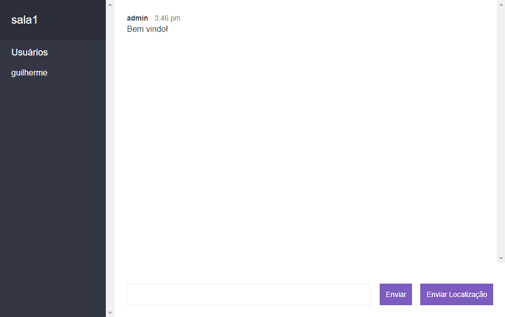

<p align="center">
  

  
  
  <a href="https://github.com/grochavieira/RealTimeChatApp/commits/master">
    
  </a>
    
   

  <a href="https://github.com/grochavieira">
    
  </a>
  
 
</p>
<h1 align="center">
    
</h1>

<h4 align="center"> 
	🚧  Aplicação finalizada! 🚧
</h4>

## 🏁 Tópicos

<p>
 👉<a href="#-sobre-o-projeto" style="text-decoration: none; "> Sobre</a> <br/>
👉<a href="#-funcionalidades" style="text-decoration: none; "> Funcionalidades</a> <br/>
👉<a href="#-layout" style="text-decoration: none"> Layout</a> <br/>
👉<a href="#-como-executar-o-projeto" style="text-decoration: none"> Como executar</a> <br/>
👉<a href="#-tecnologias" style="text-decoration: none"> Tecnologias</a> <br/>
👉<a href="#-autor" style="text-decoration: none"> Autor</a> <br/>
👉<a href="#user-content--licença" style="text-decoration: none"> Licença</a>

</p>

## 💻 Sobre o projeto

Um simples chat desenvolvido com Node.js para treinar e compreender melhor o framework Socket.io

Abaixo disponibilizei um link para o site hospedado:

<a align="center" href="https://grochavieira-chat-app.herokuapp.com/">
    
</a>

---

<a name="-funcionalidades"></a>

## ⚙️ Funcionalidades

- [x] Um usuário pode se juntar a uma sala, ao digitar um usuário, que não esteja sendo usado no momento, e uma sala.
- [x] Ao adentrar a sala o usuário recebe uma mensagem de "Bem-vindo" e os outros usuários são notificados.
- [x] Ao sair da sala os usuário restantes são notificados.
- [x] Um usuário pode mandar mensagens para usuários da mesma sala.
- [x] Um usuário pode mandar sua localização para os usuários da mesma sala visualizarem no google maps.
- [x] Um usuário que não tenha nome e sala é redirecionado para a tela principal, ou então caso ele utilize um nome de usuário que já existe na sala escolhida.

---

## 🎨 Layout

### Página de Inicio

<div align="center">
    
</div>

### Página de Chat

<div align="center">
    
</div>

---

## 🚀 Como executar o projeto

### Pré-requisitos

Antes de começar, você vai precisar ter instalado em sua máquina as seguintes ferramentas:
[Git](https://git-scm.com), [Node.js](https://nodejs.org/en/), [Yarn](https://classic.yarnpkg.com/en/docs/install).
Além disto é bom ter um editor para trabalhar com o código como [VSCode](https://code.visualstudio.com/)

#### 🧭 Rodando a aplicação

```bash

# Clone este repositório
$ git clone https://github.com/grochavieira/RealTimeChatApp.git

# Acesse a pasta do projeto no seu terminal/cmd
$ cd RealTimeChatApp

# Instale as dependências
$ npm install

# Execute a aplicação em modo de desenvolvimento
$ npm run dev

# A aplicação será aberta na porta:3333 - acesse http://localhost:3333

```

---

## 🛠 Tecnologias

As seguintes ferramentas foram usadas na construção do projeto:

#### **Website** ([Node](https://nodejs.org/en/) + HTML + CSS)

- **[Socket.io](https://socket.io/)**
- **[bad-words](https://www.npmjs.com/package/bad-words)**
- **[moment.js](https://cdnjs.com/libraries/moment.js)**
- **[mustache.js](https://cdnjs.com/libraries/mustache.js)**
- **[qs.js](https://cdnjs.com/libraries/qs)**

> Veja o arquivo [package.json](https://github.com/grochavieira/RealTimeChatApp/blob/master/package.json)

#### **Utilitários**

- Editor: **[Visual Studio Code](https://code.visualstudio.com/)**

---

<a name="-autor"></a>

## 🦸‍♂️ **Autor**

<p>
<kbd>
 
 </kbd>
 <br />
 <sub><strong>🌟 Guilherme Rocha Vieira 🌟</strong></sub>
</p>

[](https://www.linkedin.com/in/grochavieira/)
[](mailto:guirocha.hopeisaba@gmail.com)

---

## 📝 Licença

Este projeto esta sobe a licença [MIT](./LICENSE).

Feito com :satisfied: por Guilherme Rocha Vieira 👋🏽 [Entre em contato!](https://www.linkedin.com/in/grochavieira/)

---
